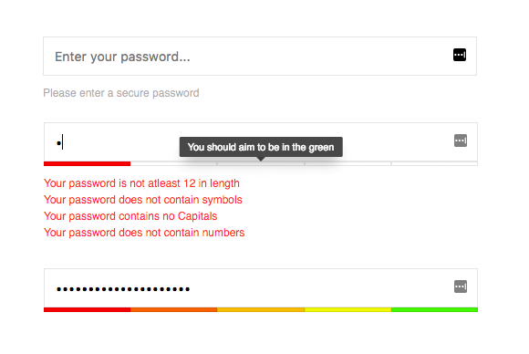
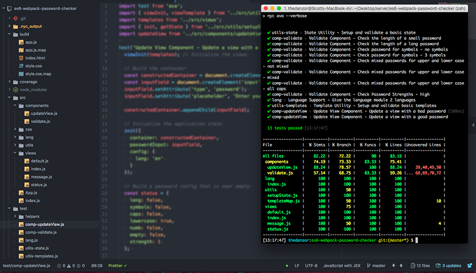

ES6 / Webpack Example - Password Checker
===================

This is a simple example of building 3rd party tooling or applications to be consumed by others.
We look at some nice front-end practices while also exploring ES6, Webpack and babel.

The tool is designed to be embeddable onto 3rd party websites without causing conflicts or problems.
We do this by ensuring the JS and CSS are both scoped accordingly, additionally the CSS is reset inside of the container of our example.

## What this tool does
Although over-engineered for the practical use it serves, the simple demo will evaluate the password someone is entering and checks to see if it strong enough to be safe.

The purpose of building this tool is to help show AN approach to building 3rd party applications that can be embeddable and used across websites.

## Tools used for development
We use Javascript, SASS, NPM, Webpack and Babel as our main dev dependencies.

## Whats Included?

 - Webpack Module structure
 - Simple template structure using ES6 template strings
 - Simple translations support also through ES6 template strings
 - UX feedback through Visual Strength bar & messages
 - A central location that handles resources and globals, good starting point for 'application state'
 - CSS Tooltips

## NOTICE:

This project is for fun / educational purposes only and NOT intended to be directly implemented into production without modifications and review.
I am not liable or responsible for any problems, damages etc coming from the use of this project.

## Setup:

Please ensure you install all dependencies with `npm i`
You can build or watch the project using: `npm run build` or `npm run dev`

Unit tests are implemented with code coverage also. You can run `npm run test` to execute the unit tests. 
